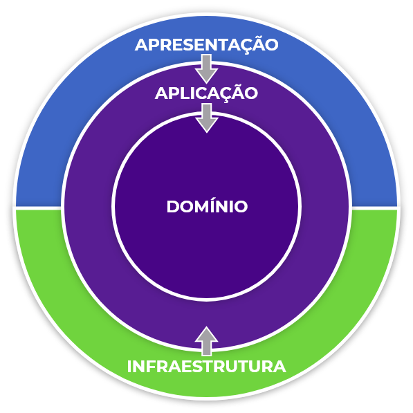

# Arquitetura

- [Arquitetura](#Arquitetura)
  - [`src/`](#Sources)
    - [Visão geral](#Visão-geral)
    - [`Application/` - Lógica de negócios](#Application---Lógica-do-aplicativo)
    - [`Domain/` - Entidade](#Domain---Entidade)
    - [`Infrastructure/` - Conexões externas](#Infrastructure---Conexões-externas)
    - [`WebAPI/`](#WebAPI)

## Sources

### Visão Geral
Aqui contém todos os arquivos e projetos, onde a interação acontecerá.
Esse projeto é desenvolvido seguindos os princípios da **Arquitetura Limpa (Clean Architecture)**.

O diagrama dá a visão geral das referências e interações de cada camada que dá forma a este software.

### Application - Lógica do aplicativo
Esta camada contém toda a lógica do aplicativo. Esta camada define interfaces que são implementadas 
por camadas externas.

**Regras sobre domains responsabilidades de cada estrutura:**

- Depende da camada de domínio, mas não depende de nenhuma outra camada ou projeto.

**Referências**
- [`Domain/`](#Domain---Entidade)

### Domain - Entidade
Esta camada conterá todas as entidades, enumerações, tipos e é onde toda a lógica de negócios deve 
estar contida.

**Regras sobre domains responsabilidades de cada estrutura:**

- Ele nunca deve interagir com qualquer camada que não seja suas próprias subpastas;
- Ele nunca deve acessar nenhuma outra classe de camada (nem mesmo indiretamente).

**Referências**
- Nenhuma

### Infrastructure - Conexões externas
Comunica-se com bibliotecas e estruturas para acessar recusos externos. Essas classes devem ser 
baseadas em interfaces definidas na camada de aplicativo.

**Referências**
- [`Domain/`](#Domain---Entidade)
- [`Application/`](#Application---Lógica-do-aplicativo)

### WebAPI
Http resquest e response.

Esta camada é um aplicativo Web API baseado em ASP.NET Core 5. 

**Regras sobre domains responsabilidades de cada estrutura:**

- Infraestrutura serve apenas para oferecer suporte à injeção de dependência;

**Referências**
- [`Application/`](#Application---Lógica-de-negócios)
- [`Infrastructure/`](#Infrastructure---Conexões-externas)